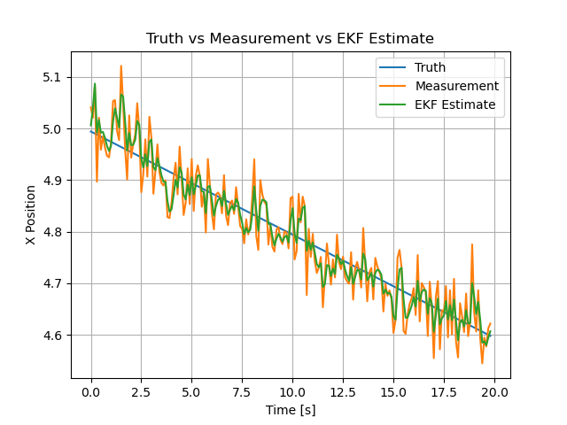

# Autonomous Spacecraft Rendezvous Estimation Pipeline

A ROS 2 Jazzy project for spacecraft relative-state simulation, noisy measurement generation, and EKF-based state estimation.

## Overview

This project simulates a simplified spacecraft relative-motion scenario and estimates the chaser state using an Extended Kalman Filter (EKF).

The system includes:
- Truth simulation node
- Noisy sensor simulation node
- EKF estimation node
- Live plotting node
- ROS 2 launch integration

## Architecture

- **space_msgs**  
  Custom ROS 2 messages for relative state, control commands, target pose, and mission status  

- **space_sim_py**  
  Truth dynamics  
  Sensor measurement generation  

- **relative_nav_py**  
  EKF state estimator  
  Live plotting node  

- **space_bringup**  
  Launch file to run the full pipeline  

## Topics

- `/truth_state`  
- `/sensor/relative_measurement`  
- `/nav/estimated_state`  

## How to Run

```bash
cd ~/space_autonomy_capture_ros2/ws
source /opt/ros/jazzy/setup.bash
colcon build --merge-install
source install/setup.bash
ros2 launch space_bringup sim_and_nav.launch.py
```

## Result

The plot below compares:
- Truth state  
- Noisy measurement  
- EKF estimate  



## Current Status

Working features:
- Constant-velocity truth simulation  
- Noisy position measurement generation  
- EKF state estimation  
- Real-time plotting  
- 10 Hz ROS 2 pipeline  

## Next Steps

- Add closed-loop control node  
- Add guidance logic  
- Add RViz or Gazebo visualization  
- Extend dynamics beyond constant velocity  
- Add spacecraft rendezvous mission phases  

## Tech Stack

- Python  
- ROS 2 Jazzy  
- NumPy  
- Matplotlib  
