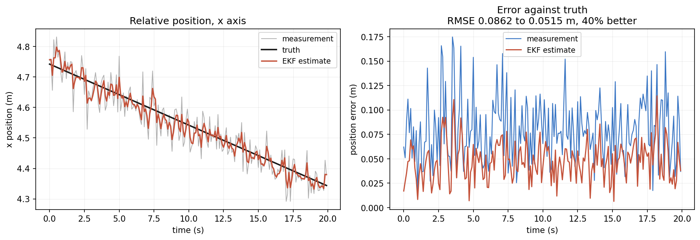

# spacecraft-relative-navigation-ekf-ros2

Spacecraft relative navigation in ROS 2 Jazzy: truth dynamics, a noisy sensor model, and an Extended Kalman Filter estimating the chaser state, running as separate nodes over the ROS 2 graph.



The EKF reduces position RMSE from 0.086 m on the raw measurements to 0.052 m, about 40 percent better. Numbers vary a little run to run since the sensor noise is stochastic.

## What is here

Four packages, three running nodes, and an analysis node that measures the result.

**space_msgs** defines the custom messages. `RelativeState` carries a timestamp, position and velocity, and is the message type on all three topics.

**space_sim_py** runs the truth dynamics and the sensor model. The truth node propagates constant-velocity relative motion; the sensor node subscribes to it, adds Gaussian noise to position, and publishes a measurement with the velocity fields zeroed, since it does not measure velocity.

**relative_nav_py** runs the EKF, which predicts on a constant-velocity model and updates on position measurements, estimating velocity from the position history. It also holds the analysis node.

**space_bringup** launches the three pipeline nodes together.

```text
truth_sim_node        publishes /truth_state
    to sensor_sim_node        publishes /sensor/relative_measurement
    to ekf_node               publishes /nav/estimated_state
```

## Results

The analysis node subscribes to all three topics, pairs samples and reports the improvement.

Pairing matters. The three nodes publish independently, so samples arrive interleaved rather than as matched triples. Comparing whichever message arrived most recently would fold the pipeline's own latency into the error, so samples are matched by nearest timestamp instead.

Only position is compared, because the sensor publishes position and zeroes the velocity fields, so a velocity comparison against the measurement would be meaningless.

| | position RMSE |
| --- | --- |
| raw measurement | 0.086 m |
| EKF estimate | 0.052 m |

The measurement figure is what the sensor model predicts: noise of 0.05 m per axis on three axes gives a position error norm around 0.087 m.

## Limitations

**Constant-velocity dynamics.** The truth model propagates in a straight line, which is a reasonable local approximation for short-baseline relative motion and is not orbital mechanics. Clohessy-Wiltshire dynamics would be the next step.

**Position measurements only.** One sensor, Gaussian noise, no bias, no dropouts, no outliers. Real relative navigation fuses several sensors with different failure modes.

**Open loop.** Nothing acts on the estimate. There is no controller, no guidance, and no mission phase logic, so this estimates state rather than doing anything with it.

**No filter consistency testing.** NEES and NIS would show whether the filter's covariance is honest about its own uncertainty, which is the standard check for an overconfident EKF.

## Requirements

ROS 2 Jazzy, Python 3.12, numpy and matplotlib.

## Setup

```bash
cd ws
source /opt/ros/jazzy/setup.bash
colcon build --merge-install
source install/setup.bash
```

## Running it

Start the pipeline:

```bash
ros2 launch space_bringup sim_and_nav.launch.py
```

In a second terminal, record for twenty seconds and report the RMSE, saving the figure to `docs/results/`:

```bash
cd ~/aerospace-portfolio/spacecraft-relative-navigation-ekf-ros2
source /opt/ros/jazzy/setup.bash
source ws/install/setup.bash
ros2 run relative_nav_py analysis_node
```

The recording window and output path are parameters:

```bash
ros2 run relative_nav_py analysis_node --ros-args -p duration:=60.0
```

Inspect the topics directly:

```bash
ros2 topic echo /nav/estimated_state
ros2 topic hz /truth_state
```

## Structure

```text
ws/src/
  space_msgs/            custom messages
    msg/RelativeState.msg    timestamp, position, velocity
  space_sim_py/
    dynamics.py              constant-velocity relative motion
    sensor_models.py         Gaussian noise on position
    truth_sim_node.py        publishes /truth_state
    sensor_sim_node.py       publishes /sensor/relative_measurement
  relative_nav_py/
    ekf.py                   the filter itself
    ekf_node.py              publishes /nav/estimated_state
    analysis_node.py         RMSE and the result figure
  space_bringup/
    launch/sim_and_nav.launch.py
docs/results/            generated figures
```

## License

MIT, see [LICENSE](LICENSE).